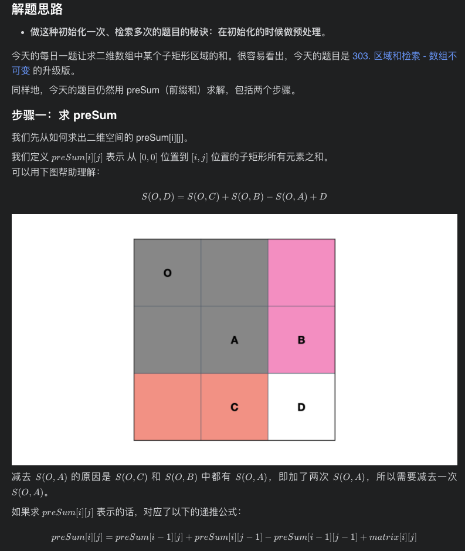
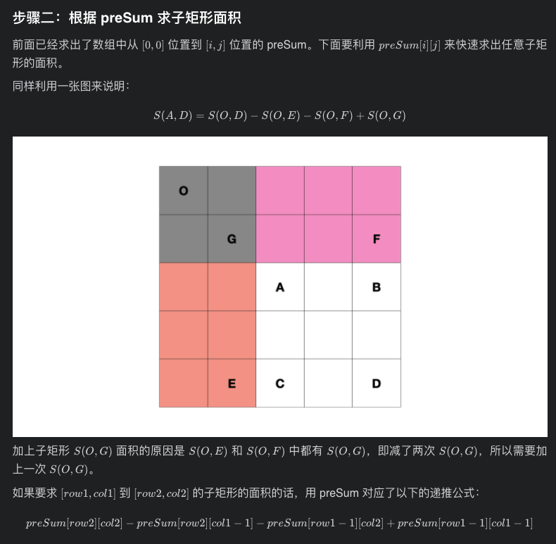

# [LeetCode 304. Range Sum Query 2D - Immutable](https://leetcode-cn.com/problems/range-sum-query-2d-immutable/)

## Methods

### Method 1

* `Time Complexity`: O(mn)
* `Space Complexity`: O(mn)
* `Intuition`:
* `Key Points`:
* `Algorithm`:




这里注意, 在构建prefixSum数组时候, 根据公式`prefixSum[i][j] = prefixSum[i-1][j] + prefixSum[i][j-1] - prefixSum[i - 1][j - 1] + matrix[i][j]`, 如果 `i` 为 `0`, 或 `j` 为 `0` 会导致 `i - 1` 或 `j - 1`为负数, 怎么办?

考虑将prefixSum多加一行和一列, 然后构建时候从 `i = 1, j = 1`开始: `prefixSum[i][j]` 对应 `matrix[i-1][j-1]`, 也就是说, matrix下标对应prefixSum 小 1

### Code

* `Code Design`:

```javascript
/**
 * @param {number[][]} matrix
 */
var NumMatrix = function(matrix) {
    const m = matrix.length, n = matrix[0].length;
    // 方便起见, prefixSum的长宽比原数组多1
    this.prefixSum = new Array(m + 1).fill(0).map(() => new Array(n + 1).fill(0));
    for (let i = 1; i < this.prefixSum.length; i++) {
        for (let j = 1; j < this.prefixSum[0].length; j++) {
            // prefixSum 的下标i, j 对应 matrix 的 i + 1, j + 1
            this.prefixSum[i][j] = this.prefixSum[i - 1][j] + this.prefixSum[i][j-1] - this.prefixSum[i-1][j-1] + matrix[i - 1][j - 1];
        }
    }
};

/**
 * @param {number} row1
 * @param {number} col1
 * @param {number} row2
 * @param {number} col2
 * @return {number}
 */
NumMatrix.prototype.sumRegion = function(row1, col1, row2, col2) {
    return this.prefixSum[row2 + 1][col2 + 1] - this.prefixSum[row2 + 1][col1] - this.prefixSum[row1][col2 + 1] + this.prefixSum[row1][col1]
};

/**
 * Your NumMatrix object will be instantiated and called as such:
 * var obj = new NumMatrix(matrix)
 * var param_1 = obj.sumRegion(row1,col1,row2,col2)
 */

```

## Reference

[leetcode ans](https://leetcode-cn.com/problems/range-sum-query-2d-immutable/solution/ru-he-qiu-er-wei-de-qian-zhui-he-yi-ji-y-6c21/)