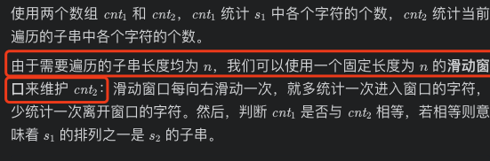

# [LeetCode 567. Permutation in String](https://leetcode-cn.com/problems/permutation-in-string/)

## Methods

### Method 1

* `Time Complexity`:
* `Space Complexity`:
* `Intuition`: Sliding Window
* `Key Points`:
由于排列不会改变字符串中每个字符的个数，所以只有当两个字符串每个字符的个数均相等时，一个字符串才是另一个字符串的排列。


* `Algorithm`: 数组 `cnt1`记录str1出现每个字母的次数, `cnt2`用来记录当前滑动窗口出现每个字母的次数, `cnt1`和`cnt2`相同, 则return true

### Code

* `Code Design`:

```javascript
var checkInclusion = function(s1, s2) {
    const n = s1.length, m = s2.length;
    if (n > m) {
        return false;
    }
    const cnt1 = new Array(26).fill(0);
    const cnt2 = new Array(26).fill(0);
    for (let i = 0; i < n; ++i) {
        ++cnt1[s1[i].charCodeAt() - 'a'.charCodeAt()];
        ++cnt2[s2[i].charCodeAt() - 'a'.charCodeAt()];
    }
    if (cnt1.toString() === cnt2.toString()) {
        return true;
    }
    for (let i = n; i < m; ++i) {
        ++cnt2[s2[i].charCodeAt() - 'a'.charCodeAt()];
        --cnt2[s2[i - n].charCodeAt() - 'a'.charCodeAt()];
        if (cnt1.toString() === cnt2.toString()) {
            return true;
        }
    }
    return false;
};
```

----------------------

### Method 2

* `Time Complexity`:
* `Space Complexity`:
* `Intuition`:
* `Key Points`:方法一, 每次比较连个数组`cnt1`和`cnt2`, 事件负责度都为O(n), 这里考虑优化
* `Algorithm`:

考虑用一个`diff`记录 `cnt1`和 `cnt2` 26个字母, 不相同字母个数的数量. 如果`diff`为0, 则返回true.
例如:

```
       a  b  c  d  e  f  g  h  i  j ...
cnt1: [3, 2, 0, 0, 0, 4, 0, 0, 0, 0, 0, 0, 0, 0, 0, 0, 0, 0, 0, 0, 0, 0, 0, 0, 0, 0]
cnt2: [0, 0, 0, 0, 1, 0, 0, 0, 1, 0, 0, 0, 0, 0, 0, 0, 0, 0, 0, 0, 0, 0, 0, 0, 0, 0]

则a, b, e, f, i出现数量不同, diff为5
```

对于每一个将要进入window的字母, 如果在进入window前, ctn1和ctn2该字母出现相等, 则进入后diff就得加一. 如果进入window前, ctn1比ctn2该字母出现次数多一, 则进入后两个字母出现次数就会相同, diff此时减一
同理, 将要被移除window的字母同理

### Code

* `Code Design`:

```javascript
/**
 * @param {string} s1
 * @param {string} s2
 * @return {boolean}
 */
var checkInclusion = function(s1, s2) {
    if (s1.length > s2.length) return false;
    const n = s1.length;
    // cnt1代表每个字母在s1内出现的次数, 初始每个数为0
    let cnt1 = new Array(26).fill(0), cnt2 = new Array(26).fill(0);
    // 对s1进行遍历, 得到cnt1
    // 同时对s2前n位遍历, 得到cnt2
    for (let i = 0; i < n; i++) {
        cnt1[s1[i].charCodeAt() - 'a'.charCodeAt()]++;
        cnt2[s2[i].charCodeAt() - 'a'.charCodeAt()]++;
    }
    // 建立diff
    let diff = 0;
    for (let i = 0; i < 26; i++) {
        if (cnt1[i] != cnt2[i]) diff++;
    }
    if (diff === 0) return true;
    // 开始滑动窗口
    // right 为 i, left 为 i - n + 1
    for (let i = n; i < s2.length; i++) {
        // 更新diff
        const index1 = s2[i].charCodeAt() - 'a'.charCodeAt(); // 进入window的字母
        const index2 = s2[i - n].charCodeAt() - 'a'.charCodeAt(); // 离开window的字母
        // 进出window字母相同
        if (s2[i] === s2[i-n]) continue;
        // update diff
        if (cnt1[index1] === cnt2[index1]) diff++;
        else if (cnt1[index1] === cnt2[index1] + 1) diff--;
        if (cnt1[index2] === cnt2[index2]) diff++
        else if (cnt1[index2] == cnt2[index2] - 1) diff--;
        // update cnt2/ 先更新diff, 因为如果cnt2先更新, diff就无法判断
        cnt2[index1]++;
        cnt2[index2]--;
        // 判断diff
        if (diff === 0) return true;
    }
    return false;
};

```

----------------------

### Method 3

* `Time Complexity`:
* `Space Complexity`:
* `Intuition`:
* `Key Points`:
* `Algorithm`:

如果进入window的字母是x, 可以用一个数组ctn, 使 ctn[x] = ctn2[x] - ctn1[x], 即ctn每一个element代表: ctn2的字母比ctn1的字母多了多少个(window内的字母比s1的字母多了多少个)

### Code

* `Code Design`:

```javascript

/**
 * @param {string} s1
 * @param {string} s2
 * @return {boolean}
 */
var checkInclusion = function(s1, s2) {
    if (s1.length > s2.length) return false;
    const n = s1.length;
    // cnt的每个element表示s2目前window的字母s2[i]比s1字母多了多少个
    let cnt = new Array(26).fill(0);
    for (let i = 0; i < n; i++) {
        cnt[s2[i].charCodeAt() - 'a'.charCodeAt()]++;
    }
    for (let i = 0; i < n; i++) {
        cnt[s1[i].charCodeAt() - 'a'.charCodeAt()]--;
    }

    // 建立diff
    let diff = 0;
    for (let i = 0; i < 26; i++) {
        if (cnt[i] !== 0) diff++;
    }
    if (diff === 0) return true;
    // 开始滑动窗口
    // right 为 i, left 为 i - n + 1
    for (let i = n; i < s2.length; i++) {
        // 更新diff
        const index1 = s2[i].charCodeAt() - 'a'.charCodeAt(); // 进入window的字母
        const index2 = s2[i - n].charCodeAt() - 'a'.charCodeAt(); // 离开window的字母
        // update cnt
        if (s2[i] === s2[i-n]) continue; // 进出window字母相同
        // 进来的字母
        if (cnt[index1] === 0) diff++;
        else if (cnt[index1] === -1) diff--; // 只少了一个, 进来字母后就会相同
        // 移除的字母
        if (cnt[index2] === 0) diff++
        else if (cnt[index2] === 1) diff--;
        cnt[index1]++;
        cnt[index2]--;
        // 判断diff
        if (diff === 0) return true;
    }
    return false;
};
```

----------------------

### Method 4

* `Algorithm`:

[可以用map代替数组](https://leetcode-cn.com/problems/permutation-in-string/solution/zhu-shi-chao-xiang-xi-de-hua-dong-chuang-rc7d/)

----------------------

### Method 5

* `Time Complexity`:
* `Space Complexity`:
* `Intuition`: 双指针, sliding window
* `Key Points`:
* `Algorithm`:

题目要求，在s2中找到s1字符串，这个子串顺序可以随意，但字符必须一个不多，一个不少。
所以，按题意，求的是在s1长度内，s2是否含有和s1字符个数一样的子串。
建立一个数组，下标0～25分别代表26个小写英文字母，每个元素用于计算s1和s2中的个数。
如果s1中存在某个字母，数组对应的元素-1；
如果s2中存在某个字母，数组对应的元素+1；
检查这个数组对应元素的大小，如果大于1，说明该字母不在s1中，丢弃该窗口，考虑下一个窗口；
否则，判断窗口大小是否等于s1的大小，是，返回true，否则，继续检查s2中下一个元素；
当遍历结束仍没找到，返回false

### Code

* `Code Design`:

```cpp
bool checkInclusion(char* s1, char* s2) {
    int len1 = strlen(s1), len2 = strlen(s2);
    if (len1 > len2) {
        return false;
    }
    int* cnt = calloc(26, sizeof(int));
    for (int i = 0; i < len1; ++i) {
        cnt[s1[i] - 'a'] -= 1;
    }
    int left = 0;
    for (int right = 0; right < len2; ++right) {
        int x = s2[right] - 'a';
        cnt[x] += 1;
        while (cnt[x] > 0) {
            cnt[s2[left] - 'a'] -= 1;
            left += 1;
        }
        if (right - left + 1 == len1) {
            return true;
        }
    }
    return false;
}

```

## Reference

[leetcode ans](https://leetcode-cn.com/problems/permutation-in-string/solution/zi-fu-chuan-de-pai-lie-by-leetcode-solut-7k7u/)