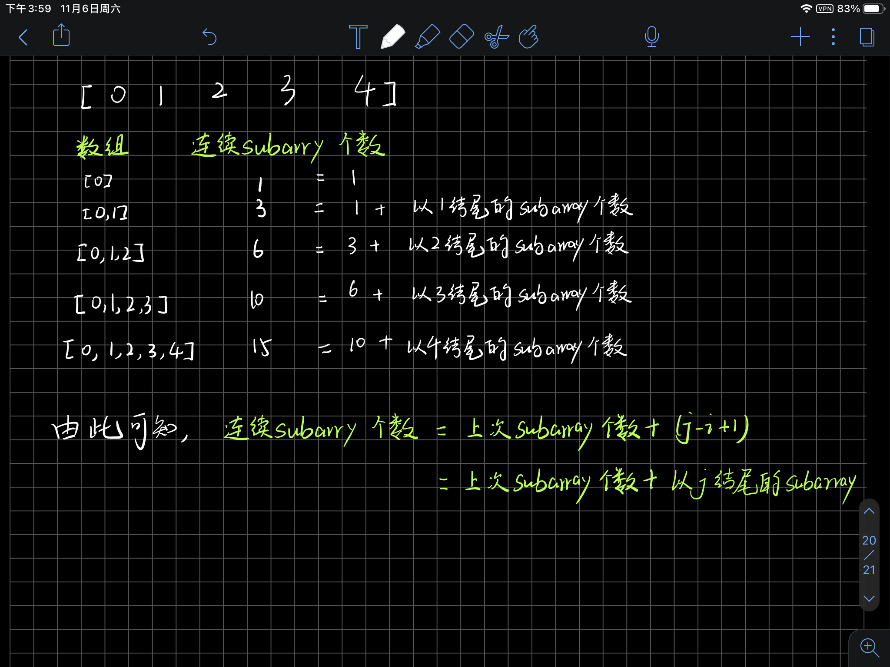
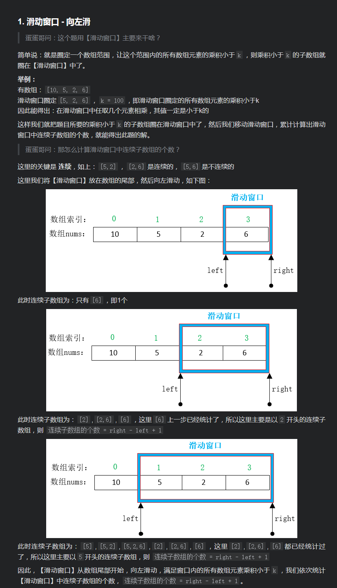
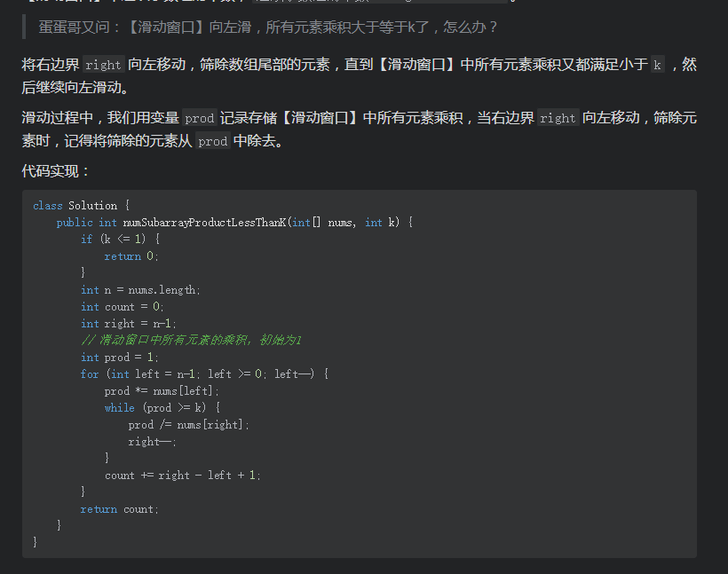
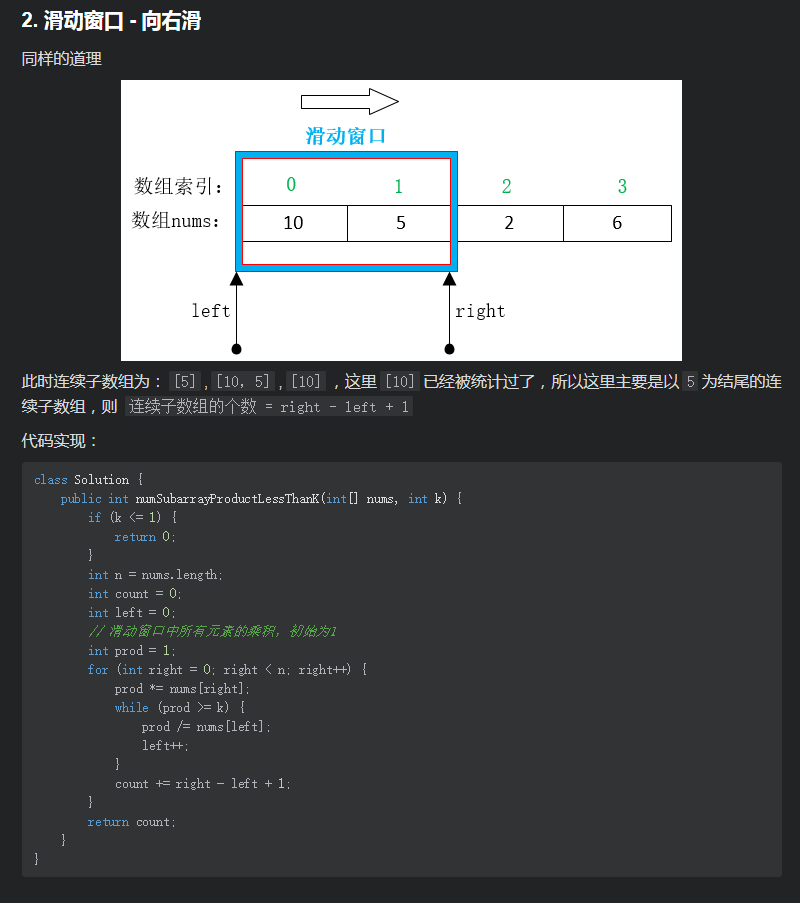

# [LeetCode 713. Subarray Product Less Than K](https://leetcode-cn.com/problems/subarray-product-less-than-k/)

## Methods

### Method 1

* `Time Complexity`: O(N^2)
* `Space Complexity`:
* `Intuition`:
* `Key Points`:
* `Algorithm`:

brute force.

it's so garbage

### Code

* `Code Design`:

```javascript
/**
 * @param {number[]} nums
 * @param {number} k
 * @return {number}
 */
var numSubarrayProductLessThanK = function(nums, k) {
    if (k === 0) return 0;
    let ans = 0;
    let product = 1
    for (let left = 0; left < nums.length; left++) {
        product = 1;
        for (let right = left; right < nums.length; right++) {
            product *= nums[right];
            if (product < k) ans++;
            else continue;
        }
    }
    return ans;
};

```

----------------------

### Method 2

* `Time Complexity`:
* `Space Complexity`:
* `Intuition`: sliding window
* `Key Points`: 向左滑动
* `Algorithm`:

该题的难点是, index为i和j时候, 如何计算i,j之间连续subarray的总数量?
方法:






----------------------

### Method 3

* `Time Complexity`:
* `Space Complexity`:
* `Intuition`: sliding window
* `Key Points`: 向右滑动
* `Algorithm`:



## Reference

[leetcode ans](https://leetcode-cn.com/problems/subarray-product-less-than-k/solution/javahua-dong-chuang-kou-xiang-zuo-hua-hu-dftx/)