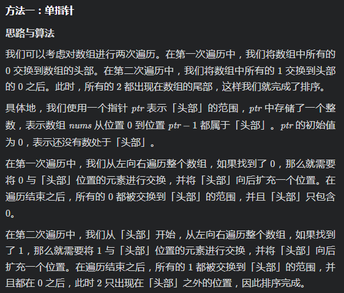

# [LeetCode 75. Sort Colors](https://leetcode-cn.com/problems/sort-colors/)

## Methods

一般方法, quick sort 或者 merge sort 一定能解决,  时间复杂度 `O(nlogN)`, 有没有可能优化?

1. 当然可以考虑计数排序, 扫描一遍记录每个数字出现的次数. 然后再重新建立一个排好序的数组就行, 时间复杂度O(n)
2. 是否可以利用quick sort的思想呢?

### Method 1

* `Time Complexity`: O(n)
* `Space Complexity`: O(1)
* `Intuition`: iterate array two times + just one pointer
* `Key Points`:
* `Algorithm`:


(图片有误, 应该理解为方法一: 两指针)

### Code1

* `Code Design`:

```java
class Solution {
    public void sortColors(int[] nums) {
        int n = nums.length;
        int ptr = 0;
        for (int i = 0; i < n; ++i) {
            if (nums[i] == 0) {
                int temp = nums[i];
                nums[i] = nums[ptr];
                nums[ptr] = temp;
                ++ptr;
            }
        }
        for (int i = ptr; i < n; ++i) {
            if (nums[i] == 1) {
                int temp = nums[i];
                nums[i] = nums[ptr];
                nums[ptr] = temp;
                ++ptr;
            }
        }
    }
}

```

## Reference1

作者：LeetCode-Solution
链接：https://leetcode-cn.com/problems/sort-colors/solution/yan-se-fen-lei-by-leetcode-solution/
来源：力扣（LeetCode）
著作权归作者所有。商业转载请联系作者获得授权，非商业转载请注明出处。

----------------------

### Method 2

* `Time Complexity`: O(n)
* `Space Complexity`: O(1)
* `Intuition`:
* `Key Points`:
* `Algorithm`:

三指针, 只遍历一次. 定义从`[0, p0)` 区间均为0, 定义从`[p0, p1)`均为1, 则因为指针`i`遍历过的数组都是已经知道的值, 所以从`[p1, i)`区间均为2

```
0 ..... p0  ....... p1  ......., i
0 0 0 0  1 1 1 1 1 1 2 2 2 2 2 2 x
```

`i`遍历过程中:
如果遇到nums[i] 为2, 直接continue掉
如果遇到nums[i] 为1, 跟p1交换就可
如果遇到nums[i] 为0, 这时候如果跟p0交换, 会把本应该存在p0处的`1`移到i位置去, 这时候就要再考虑将p1跟i再交换一遍

### Code2

* `Code Design`:

```python
class Solution:
    def sortColors(self, nums: List[int]) -> None:
        """
        Do not return anything, modify nums in-place instead.
        """
        p0, p1 = 0, 0

        for i in range(len(nums)):
            if nums[i] == 0:
                nums[i], nums[p0] = nums[p0], nums[i]
                if p1 > p0:
                    nums[i], nums[p1] = nums[p1], nums[i]
                p0 += 1
                p1 += 1
            elif nums[i] == 1:
                nums[i], nums[p1] = nums[p1], nums[i]
                p1 += 1
        return
```

## Reference2
