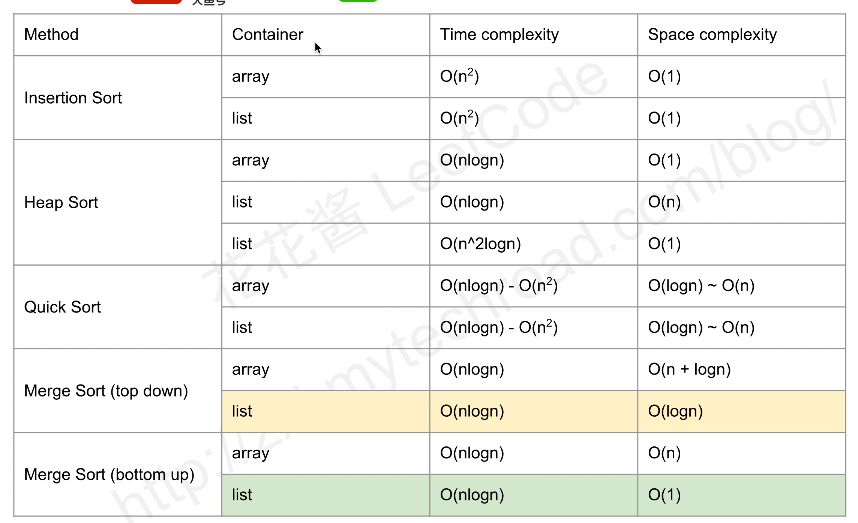

# [LeetCode 148. Sort List](https://leetcode.cn/problems/sort-list/description/)

## Methods

### Method 1

* `Time Complexity`: 
* `Intuition`:
* `Key Points`: merge sort
* `Algorithm`:

### Code

* `Code Design`:

```javascript
/**
 * Definition for singly-linked list.
 * function ListNode(val, next) {
 *     this.val = (val===undefined ? 0 : val)
 *     this.next = (next===undefined ? null : next)
 * }
 */
/**
 * @param {ListNode} head
 * @return {ListNode}
 */
var sortList = function(head) {
    if (!head) return null;

    return divided(head);
};

var findMid = function(node) {
    let slow = node;
    let fast = node.next;
    while (fast && fast.next) {
        fast = fast.next.next;
        slow = slow.next;
    }

    return slow;
}

var divided = function(node) {
    if (!node.next) return node;

    // find mid node
    let mid = findMid(node);
    let rightStart = mid.next;

    // split
    mid.next = null;
    // continue divided
    let left = divided(node);
    let right = divided(rightStart);

    return merge(left, right);
}

var merge = function(list1, list2) {
    const dummy = new ListNode();
    let tail = dummy;
    let p1 = list1;
    let p2 = list2;

    while(p1 && p2) {
        if (p1.val > p2.val) {
            tail.next = p2;
            p2 = p2.next;
        } else {
            tail.next = p1;
            p1 = p1.next;
        }
        tail = tail.next;
    }

    if (p1) {
        tail.next = p1;
    } else {
        tail.next = p2;
    }
    return dummy.next;
};
```

## Reference
