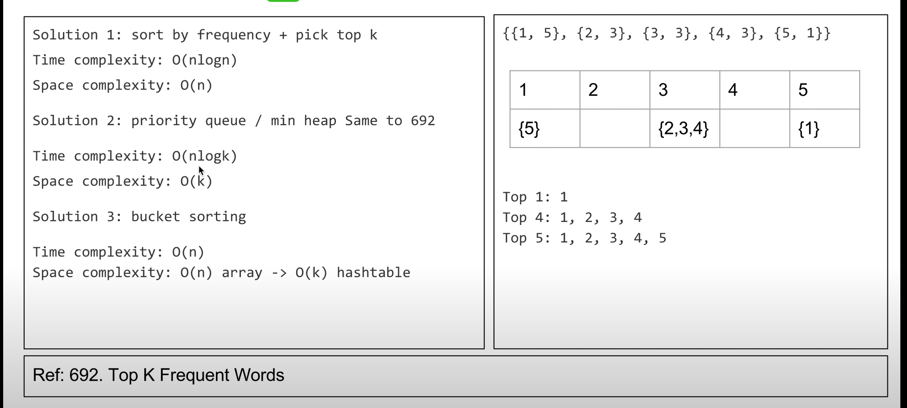
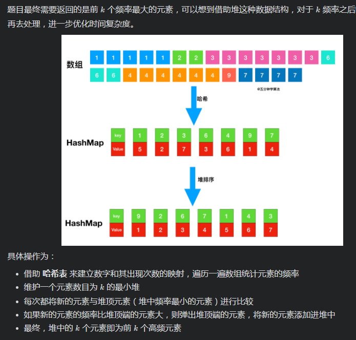

# LeetCode 347. Top K Frequent Elements

[LeetCode 347  Top K Frequent Elements](https://leetcode.com/problems/top-k-frequent-elements/)

## Methods



方法二, k为n时候最糟糕,还是nlogn复杂度

### Method 1

* `Time Complexity`: o(n)
* `Intuition`: buckets sort
* `Key Points`: use map to store num and frequency, then build a buckets array, find top k
* `Algorithm`:

### Code

* `Code Design`:

```javascript
/**
 * @param {number[]} nums
 * @param {number} k
 * @return {number[]}
 */
var topKFrequent = function(nums, k) {
    const buckets = [];
    const num2count = {};

    // maintain map, key is num, value is frequency
    for (let num of nums) {
        if (!num2count[num]) {
            num2count[num] = 1;
            continue;
        }
        num2count[num] += 1;
    }
    // build buckets
    for (let num in num2count) {
        const count = num2count[num];
        if (!buckets[count]) {
            buckets[count] = [];
        }
        buckets[count].push(num);
    }

    let ans = [];
    for (let i = buckets.length - 1; i > 0 && ans.length <　k; i--) {
        if (buckets[i]) {
            ans = ans.concat(buckets[i]);
        }
    }
    return ans;
};

```

### reference

[buckets sort](https://www.youtube.com/watch?v=lm6pBga98-w)

----------------

### method 2

* `Time Complexity`: o(nlogk)
* `Intuition`: heap
* `Key Points`:
* `Algorithm`:



### Code

* `Code Design`:

```javascript
class Solution:
    def topKFrequent(self, nums: List[int], k: int) -> List[int]:
        count = collections.Counter(nums)
        heap = []
        for key, val in count.items():
            if len(heap) >= k:
                if val > heap[0][0]:
                    heapq.heapreplace(heap, (val, key))
            else:
                heapq.heappush(heap, (val, key))
        return [item[1] for item in heap]
```

## Reference

[leetcode 思路](https://leetcode-cn.com/problems/top-k-frequent-elements/solution/leetcode-di-347-hao-wen-ti-qian-k-ge-gao-pin-yuan-/)

[leetcode 代码](https://leetcode-cn.com/problems/top-k-frequent-elements/solution/347-qian-k-ge-gao-pin-yuan-su-zhi-jie-pa-wemd/)
