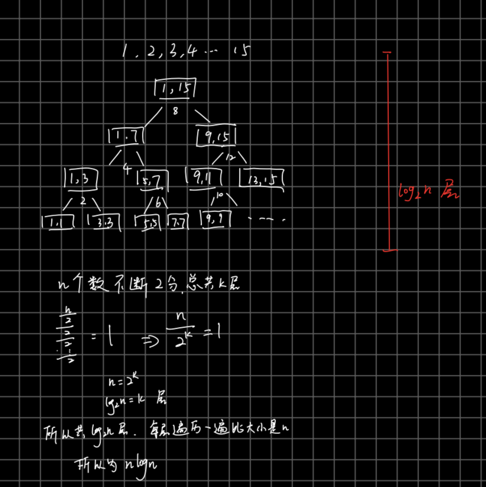

# sort

## 1. merge sort

key word is MERGE, which merges two sorted arrays using double pointers.

```python
arr = [1, 3, 5, 7, 9, 2, 4, 6, 8, 10]

1st part = [1, 3, 5, 7 , 9]
2nd part = [2, 4, 6, 8, 10]
they are two sorted array.
then

            i ->
1st part = [1, 3, 5, 7 , 9]
2nd part = [2, 4, 6, 8, 10]
            j ->

3rd part = [0, 0, 0, 0, 0, 0, 0, ...]
            x ->
```

```python
class Solution(object):
    def sortArray(self, nums):
        """
        :type nums: List[int]
        :rtype: List[int]
        """
        temp = [0 for _ in range(len(nums))]
        self.divide(0, len(nums) - 1, nums, temp)
        return nums

    def divide(self, start, end, nums, temp):
        if start >= end:
            return
        mid = (start + end) // 2 # including mid in odd array
        self.divide(start, mid, nums, temp)
        self.divide(mid + 1, end, nums, temp)
        self.sort_merge(start, end, nums, temp)

    def sort_merge(self, start, end, nums, temp):
        # The length is at least 2
        mid = (start + end) // 2 # left part and right part is sorted
        index = start # for temp's start
        i, j = start, mid + 1 # define two pointer, try to merge the two parts. i is between [start, mid], j is between [mid + 1, end]
        while i <= mid and j <= end:
            if nums[i] <= nums[j]:
                temp[index] = nums[i]
                i += 1
            else:
                temp[index] = nums[j]
                j += 1
            index += 1
        while i <= mid:
            temp[index] = nums[i]
            i += 1
            index += 1
        while j <= end:
            temp[index] = nums[j]
            j += 1
            index += 1
        # must change original array in that, because, when compare nums[i] and nums[j] needs using last time's result on 26 line
        for index in range(start, end + 1):
            nums[index] = temp[index]
```

[time complexity](https://www.youtube.com/watch?v=-qOVVRIZzao): 

nlog(n)


## 2. quick sort

### 2.1 模板

python:

pivot为中间的版本:


java:

```java
public class QuickSort {
    public void main1(int[] nums){
        quickSort(nums, 0, nums.length -1); //用递归去排序
    }

    public void quickSort(int[] nums, int start, int end){
        if (start >= end) return;  //递归出口

        int left = start, right = end;
        int pivot = nums[ left + (right - left)/2]; //选择pivot，因为数据大部分有序，所以pivot选择到最好中间位置，这样左右均匀分布


        //将该数组大于pivot的移到其右侧，小于pivot的移到其左侧
        while (left <= right){
            while (left <= right && nums[left] < pivot){
                left++;
            }
            while(left <= right && nums[right] > pivot){
                right--;
            }
            if (left <=right){
                int temp = nums[left];
                nums[left] = nums[right];
                nums[right] = temp;

                left++;
                right--;
            }
        }
        //此时分别处理pivot左边和右边
        quickSort(nums, start, right);
        quickSort(nums, left, end);

    }
}
```

pivot为最右边数时候的快排:

定义两个指针, left和right, left左边的数都比pivot小, 不包括left. right右边的数都比pivot大, 不包括right

```python
class Solution:
    def sortArray(self, nums: List[int]) -> List[int]:
        self.divided(nums, 0, len(nums) - 1)
        return nums

    def divided(self, nums, start, end):
        if start >= end:
            return
        mid = self.partition(nums, start, end)
        self.divided(nums, start, mid - 1)
        self.divided(nums, mid + 1, end)

    def partition(self, nums, start, end):
        left = start
        right = end - 1
        pivot = end

        while left <= right:
            while left <= right and nums[left] < nums[pivot]:
                left += 1
            while left <= right and nums[right] >= nums[pivot]:
                right -= 1
            if left <= right:
                nums[left], nums[right] = nums[right], nums[left]
                left += 1
                right -= 1
        # 此时 start, ... ,right, left, ... ,end, pivot
        nums[left], nums[pivot] = nums[pivot], nums[left]
        return left
```

### 2.2 时间复杂度分析

最糟糕的时候, quick sort每次选的pivot都是最大或最小的时候, 这时候只能把一个n的数组拆分成n-1个数的数组和1个数的数组, 继续进行递归

所以

这是个等差数列, 推导如下


最糟糕情况 时间复杂度为 n^2

最好情况呢?


长度为n的数组, 每次都能把数组拆分成长度为n/2的数组, 直到长度为一. 此时, 数组的高度为logn, 每层都是n的时间复杂度. 所以总共为O(nlogN)

## 3. selection sort

time complexity: `O(n^2)`
space complexity: `O(1)`

The selection sort algorithm sorts an array by repeatedly finding the minimum element (considering ascending order) from unsorted part and putting it at the beginning. The algorithm maintains two subarrays in a given array.

1) The subarray which is already sorted.
2) Remaining subarray which is unsorted.

```python

import sys
A = [64, 25, 12, 22, 11]

# Traverse through all array elements
for i in range(len(A)):
    # Find the minimum element in remaining
    # unsorted array
    min_idx = i
    for j in range(i+1, len(A)):
        if A[min_idx] > A[j]:
            min_idx = j

    # Swap the found minimum element with
    # the first element
    A[i], A[min_idx] = A[min_idx], A[i]
```