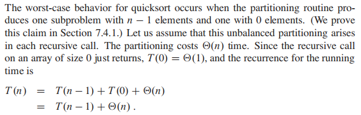

# sort

## 1. quick sort

### 1.1 模板

python:

pivot为中间的版本:


java:

```java
public class QuickSort {
    public void main1(int[] nums){
        quickSort(nums, 0, nums.length -1); //用递归去排序
    }

    public void quickSort(int[] nums, int start, int end){
        if (start >= end) return;  //递归出口

        int left = start, right = end;
        int pivot = nums[ left + (right - left)/2]; //选择pivot，因为数据大部分有序，所以pivot选择到最好中间位置，这样左右均匀分布


        //将该数组大于pivot的移到其右侧，小于pivot的移到其左侧
        while (left <= right){
            while (left <= right && nums[left] < pivot){
                left++;
            }
            while(left <= right && nums[right] > pivot){
                right--;
            }
            if (left <=right){
                int temp = nums[left];
                nums[left] = nums[right];
                nums[right] = temp;

                left++;
                right--;
            }
        }
        //此时分别处理pivot左边和右边
        quickSort(nums, start, right);
        quickSort(nums, left, end);

    }
}
```

pivot为最右边数时候的快排:
```python
class Solution:
    def sortArray(self, nums: List[int]) -> List[int]:
        self.divided(nums, 0, len(nums) - 1)
        return nums

    def divided(self, nums, start, end):
        if start >= end:
            return
        mid = self.partition(nums, start, end)
        self.divided(nums, start, mid - 1)
        self.divided(nums, mid + 1, end)

    def partition(self, nums, start, end):
        left = start
        right = end - 1
        pivot = end

        while left <= right:
            while left <= right and nums[left] < nums[pivot]:
                left += 1
            while left <= right and nums[right] >= nums[pivot]:
                right -= 1
            if left <= right:
                nums[left], nums[right] = nums[right], nums[left]
                left += 1
                right -= 1
        # 此时 start, ... ,right, left, ... ,end, pivot
        nums[left], nums[pivot] = nums[pivot], nums[left]
        return left
```

### 1.2 时间复杂度分析

最糟糕的时候, quick sort每次选的pivot都是最大或最小的时候, 这时候只能把一个n的数组拆分成n-1个数的数组和1个数的数组, 继续进行递归

所以

这是个等差数列, 推导如下


最糟糕情况 时间复杂度为 n^2

最好情况呢?

推导很麻烦, 直接得出结论: 为O(nlogN)

## 2. merge sort


## 3. selection sort

time complexity: `O(n^2)`
space complexity: `O(1)`

The selection sort algorithm sorts an array by repeatedly finding the minimum element (considering ascending order) from unsorted part and putting it at the beginning. The algorithm maintains two subarrays in a given array.

1) The subarray which is already sorted.
2) Remaining subarray which is unsorted.

```python

import sys
A = [64, 25, 12, 22, 11]

# Traverse through all array elements
for i in range(len(A)):
    # Find the minimum element in remaining
    # unsorted array
    min_idx = i
    for j in range(i+1, len(A)):
        if A[min_idx] > A[j]:
            min_idx = j

    # Swap the found minimum element with
    # the first element
    A[i], A[min_idx] = A[min_idx], A[i]
```