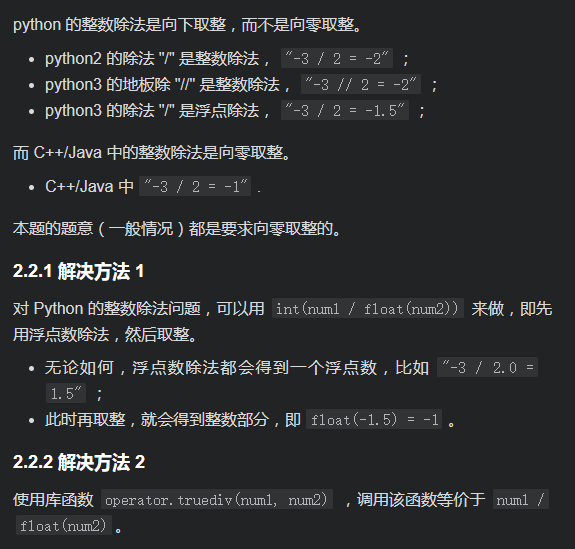

# [LeetCode 150. Evaluate Reverse Polish Notation](https://leetcode-cn.com/problems/evaluate-reverse-polish-notation/)

## Methods

### Method 1

* `Time Complexity`:
* `Space Complexity`:
* `Intuition`:
* `Key Points`:
* `Algorithm`:

坑:


### Code1

* `Code Design`:

```python
class Solution:
    def evalRPN(self, tokens: List[str]) -> int:
        stack = []
        validOerator = {'+', '-', '*', '/'}
        operator = None
        for i in range(len(tokens)):
            if tokens[i] in validOerator:
                num2 = stack.pop()
                num1 = stack.pop()
                num3 = 0
                if tokens[i] == '+':
                    num3 = num1 + num2
                elif tokens[i] == '-':
                    num3 = num1 - num2
                elif tokens[i] == '*':
                    num3 = num1 * num2
                else:
                    num3 = int(num1 / float(num2))
                    if abs(num1) < abs(num2): num3 = 0
                stack.append(num3)
            else:
                num3 = int(tokens[i])
                stack.append(num3)
        return stack.pop()

```

## Reference1

[leetcode ans](https://leetcode-cn.com/problems/evaluate-reverse-polish-notation/solution/xiang-jie-ni-bo-lan-biao-da-shi-fu-ben-t-sfl6/)

----------------------

### Method 2

* `Time Complexity`:
* `Space Complexity`:
* `Intuition`:
* `Key Points`:
* `Algorithm`:

we need to know how a string transfer a integer:  `Integer.valueOf()`

### Code2

* `Code Design`:

```java
package LeetCode_Java.Stack.Evaluate_Reverse_Polish_Notation;

import java.util.Stack;

public class Evaluate_Reverse_Polish_Notation {
    public int evalRPN(String[] tokens) {
        Stack<Integer> stack = new Stack<>();
        String operators = "+-*/";

        for (String token : tokens){
            if (operators.contains(token)){
                int a = stack.pop();
                int b = stack.pop();
                if (token.equals("+")) stack.push(b + a);
                else if (token.equals("-")) stack.push(b - a);
                else if (token.equals("*")) stack.push(b * a);
                else stack.push(b / a);
                continue;
            }
            stack.push(Integer.valueOf(token));
        }
        return stack.pop();
    }
}

```

## Reference2

besides, we need to know what is the Reverse Polish Notation: https://www.youtube.com/watch?v=qN8LPIcY6K4
