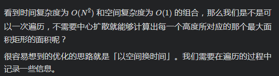
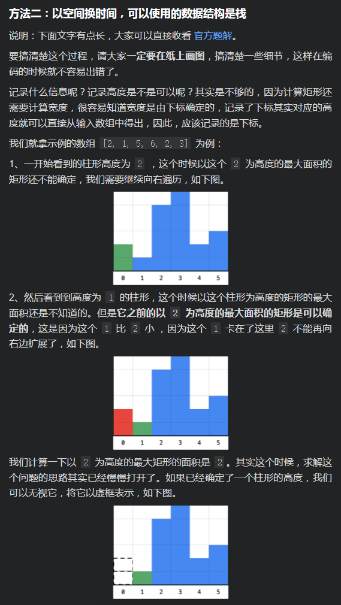

# 84. Largest Rectangle in Histogram

[LeetCode 84](https://leetcode.com/problems/largest-rectangle-in-histogram/)

## Methods

### Method 1

* `Time Complexity`: O(n^2)
* `Intuition`: brute force
* `Algorithm`:

First, consider the `brute force`:

for every `height[i]` need to find a `leftBound` that height shorter than `height[i]` and `rightBound` shorter than `height[i]`
then `area = (rightBound - leftBound - 1) * height[i]`


time complexity O(n^2)

```java
public class Solution {

    public int largestRectangleArea(int[] heights) {
        int len = heights.length;
        // 特判
        if (len == 0) {
            return 0;
        }

        int res = 0;
        for (int i = 0; i < len; i++) {

            // 找左边最后 1 个大于等于 heights[i] 的下标
            int left = i;
            int curHeight = heights[i];
            while (left > 0 && heights[left - 1] >= curHeight) {
                left--;
            }

            // 找右边最后 1 个大于等于 heights[i] 的索引
            int right = i;
            while (right < len - 1 && heights[right + 1] >= curHeight) {
                right++;
            }

            int width = right - left + 1;
            res = Math.max(res, width * curHeight);
        }
        return res;
    }
}
```

so the target becomes how to find the `leftBound` and `rightbound` more efficiently.

----------------------

### Method 2

* `Time Complexity`: O(n)
* `Intuition`: use 2 arrays `leftLess` and `rightLess` to store every element left height less than it and right height less than it
* `Algorithm`:

use 2 arrays `leftLess` and `rightLess` to store every element left height less than it and right height less than it
how to build `leftLess[]` ?

set the `leftLess` store the index

```
leftLess[0] = -1;//there is no left bar at the first bar so set the first ele -1
for (int i = 1; i < heights.length; i++) {
    int p = i - 1;
    //p keep reducing so as to let height[p] < height[i]
    while (p >= 0 && height[p] >= height[i]) {
        p--;
    }
    leftLess[i] = p;
}
```
the time complexity is O(n^2), we could optimize it.


for current index `i`, if `height[i-1]` is taller than it, we could find `p` from `leftLess[i-1]`.
```
int[] leftLess = new int[heights.length];
leftLessMin[0] = -1;
for (int i = 1; i < heights.length; i++) {
    int l = i - 1;
    //当前柱子更小一些，进行左移
    while (l >= 0 && heights[l] >= heights[i]) {
        l = leftLess[l];
    }
    leftLess[i] = l;
}

```

### Code

```java
class solution {
    public int largestRectangleArea(int[] heights) {
        if (heights.length == 0) {
            return 0;
        }
        //求每个柱子的左边第一个小的柱子的下标
        int[] leftLessMin = new int[heights.length]; // leftLess[i] denotes the index smaller than height[i]
        leftLessMin[0] = -1;
        for (int i = 1; i < heights.length; i++) {
            int l = i - 1;
            while (l >= 0 && heights[l] >= heights[i]) {
                l = leftLessMin[l];
            }
            leftLessMin[i] = l;
        }

        //求每个柱子的右边第一个小的柱子的下标
        int[] rightLessMin = new int[heights.length];
        rightLessMin[heights.length - 1] = heights.length;
        for (int i = heights.length - 2; i >= 0; i--) {
            int r = i + 1;
            while (r <= heights.length - 1 && heights[r] >= heights[i]) {
                r = rightLessMin[r];
            }
            rightLessMin[i] = r;
        }

        //求包含每个柱子的矩形区域的最大面积，选出最大的
        int maxArea = 0;
        for (int i = 0; i < heights.length; i++) {
            int area = (rightLessMin[i] - leftLessMin[i] - 1) * heights[i];
            maxArea = Math.max(area, maxArea);
        }
        return maxArea;
    }
}
```

----------------------

### Method 3

* `Time Complexity`: O(n)
* `Intuition`: monotonic stack. use `stack` to simulate `leftLess` and current index `i` is the `rightBound`
* `Algorithm`:
  * `area = (rightBound - leftBound - 1) * height`
  * optimize the method 2. In order to optimize the `leftLess[]` and `rightLess[]`, we could combine them. let current `i` is the `rightBound`, `stack.peek()` is the height, the second stack peek is the `leftBound`
  * stack peek is the `height` , so `height = stack.getLast()`
  * `leftBound` and `rightBound` are not include in area
  * need to guarantee `height > Min(height[leftBound], height[rightRbound])`

### Code

```java
public class Solution {
    public int largestRectangleArea(int[] heights) {
        int maxArea = 0;
        Deque<Integer> stack = new ArrayDeque<>();
        int p = 0;
        while (p < heights.length) {
            //if stack is null, push current index into stack
            if (stack.isEmpty()) {
                stack.add(p);
                p++;
            } else { // if stack is not null
                int top = stack.peek();
                //当前高度大于栈顶，入栈
                if (heights[p] >= heights[top]) {
                    stack.push(p);
                    p++;
                } else {
                    // when heights[p] < heights[top], p is rightBound
                    //保存栈顶高度
                    int height = heights[stack.pop()];
                    //左边第一个小于当前柱子的下标
                    int leftLessMin = stack.isEmpty() ? -1 : stack.peek();
                    //右边第一个小于当前柱子的下标
                    int RightLessMin = p;
                    //计算面积
                    int area = (RightLessMin - leftLessMin - 1) * height;
                    maxArea = Math.max(area, maxArea);
                }
            }
        }
        while (!stack.isEmpty()) {
            //保存栈顶高度
            int height = heights[stack.pop()];
            //左边第一个小于当前柱子的下标
            int leftLessMin = stack.isEmpty() ? -1 : stack.peek();
            //右边没有小于当前高度的柱子，所以赋值为数组的长度便于计算
            int RightLessMin = heights.length;
            int area = (RightLessMin - leftLessMin - 1) * height;
            maxArea = Math.max(area, maxArea);
        }
        return maxArea;
    }
}
```

----------------------

### Method 4

单调栈除了用上述方法解释外, 还可以:






### Code1

* `Code Design`:

加入哨兵

```python
from typing import List


class Solution:
    def largestRectangleArea(self, heights: List[int]) -> int:
        size = len(heights)
        res = 0
        heights = [0] + heights + [0]
        # 先放入哨兵结点，在循环中就不用做非空判断
        stack = [0]
        size += 2

        for i in range(1, size):
            while heights[i] < heights[stack[-1]]:
                cur_height = heights[stack.pop()]
                cur_width = i - stack[-1] - 1
                res = max(res, cur_height * cur_width)
            stack.append(i)
        return res

```

----------------------

## Reference

[leetcode ans](https://leetcode-cn.com/problems/largest-rectangle-in-histogram/solution/bao-li-jie-fa-zhan-by-liweiwei1419/)
[video](https://leetcode-cn.com/problems/largest-rectangle-in-histogram/solution/zhu-zhuang-tu-zhong-zui-da-de-ju-xing-by-leetcode-/)

[A Chinese Blog](https://leetcode.wang/leetCode-84-Largest-Rectangle-in-Histogram.html)
