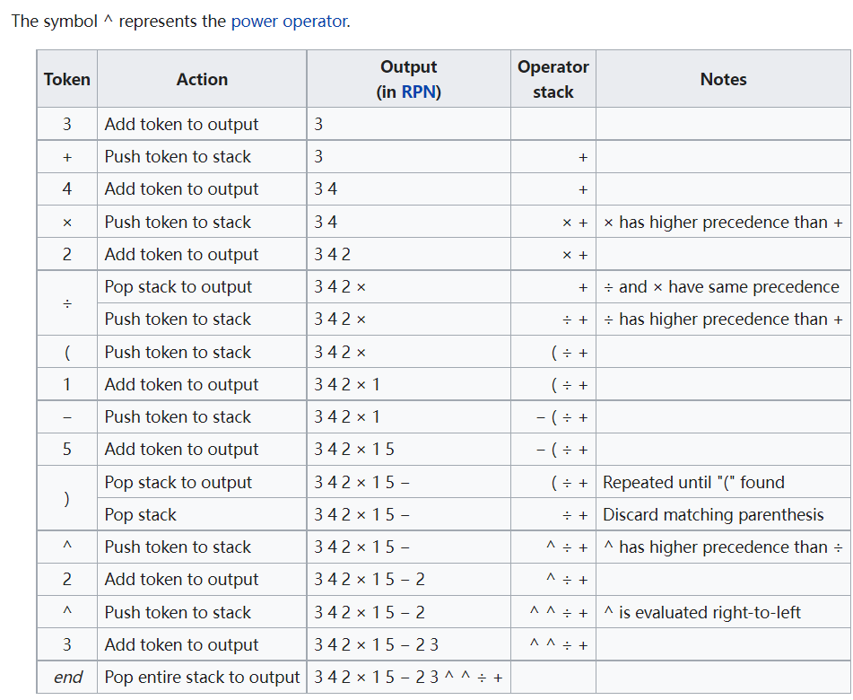

# [Shunting-yard algorithm](https://en.wikipedia.org/wiki/Shunting-yard_algorithm)

计算机解析计算式的方式, 可以将人类书写喜欢的中缀符号转换为后缀符号(逆波兰表达式):

In computer science, the shunting-yard algorithm is a method for parsing mathematical expressions specified in infix notation. It can produce either a postfix notation string, also known as Reverse Polish notation (RPN), or an abstract syntax tree (AST).

