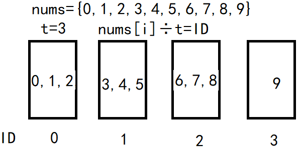

# [LeetCode 220. Contains Duplicate III](https://leetcode-cn.com/problems/contains-duplicate-iii/)

## Methods

### Method 1(Brute force)

* `Time Complexity`: O(n * k)
* `Space Complexity`:
* `Intuition`:
* `Key Points`:
* `Algorithm`:

let i from 0 to the end of the array, j keeps the k distance from i. Every time, calculate in the k size window  , whether there is a nums[j] which satisfy `nums[j] - nums[i] <= t`

### Code1

* `Code Design`:

```python
class Solution:
    def containsNearbyAlmostDuplicate(self, nums: List[int], k: int, t: int) -> bool:
        for i in range(len(nums)):
            j = i + 1
            while j < len(nums) and j - i <= k:
                if j < len(nums) and abs(nums[i] - nums[j]) <= t:
                    return True
                j += 1
        return False
```

## Reference1

----------------------

### Method 2

* `Time Complexity`: O(n* logk)
* `Space Complexity`:
* `Intuition`:
* `Key Points`:
* `Algorithm`:

how to build a k size window and maintain it (by using algorithm or data structure)?
the window should have the following features:
    1. every time maintain k size
    2. every time it could give you the closest number when you input a specific number
TreeSet
it has ceiling and floor method, which will give you the smallest number larger than nums[i] and the largest number smaller than nums[i]

treeset is a black-red tree

### Code2

* `Code Design`:

```java
package LeetCode_Java.DFS.Contains_Duplicate_III;

import java.util.TreeSet;

public class Contains_Duplicate_III {
    public boolean containsNearbyAlmostDuplicate(int[] nums, int k, int t) {
        TreeSet<Integer> set = new TreeSet<>();

        for (int i = 0; i < nums.length; i ++){
            Integer ceil = set.ceiling(nums[i]); // the smallest number larger than nums[i]
            if (ceil != null && Long.valueOf(ceil) - Long.valueOf(nums[i]) <= t) return true;

            Integer floor = set.floor(nums[i]); // the largest number smaller than nums[i]
            if (floor != null && Long.valueOf(nums[i]) - Long.valueOf(floor) <= t ) return true;

            set.add(nums[i]);
            if (i >= k) set.remove(nums[i-k]);
        }
        return false;
    }
}
```

## Reference2

----------------------

### Method 3(best method)

* `Time Complexity`: O(n)
* `Space Complexity`: O(k)
* `Intuition`:
对于一个宽度为k的window, 每次判断window内所有数是否满足`abs(nums[j] - nums[i]) <= t` => 某个数是否落在window内任意数`num-t ~ num+t`内 => 建造桶
* `Key Points`: bucket
* `Algorithm`:

如果我们能从最小的数`min`开始, 一个数num <= `min + t`, 就把它放进和`min`一个桶里面
接着 `min + t`< num <= `min + 2t` 就放到第二个桶里
以此类推, 我们就有了`(max - min) / t`个桶
每次一个新的数字`nums[i]`, 我们就判断它属于哪一个桶的, 如果这个桶内有其他数字, 他们的差值一定小于等于t, 所以返回`true`
如果该桶为空, 我们还要看下和这个桶相邻的前后桶, 因为这两个桶内也会存在某些数字数字`nums[j]`, 使`abs(nums[j] - nums[i]) <= t`

### Code3

* `Code Design`:

t为0要单独处理时候的代码:

```python
class Solution:
    def containsNearbyAlmostDuplicate(self, nums: List[int], k: int, t: int) -> bool:
        if t == 0: return self.whenTIsZero(nums, k, t)

        # 找到最小的数, 构建桶, 每个通容纳的数字范围: `minNum ~ minNum + t`, `minNum + t ~ minNum + 2t`, ...
        minNum = sys.maxsize
        for i in range(len(nums)):
            minNum = min(nums[i], minNum)

        bucket = {}
        for i in range(len(nums)):
            bucketIndex = (nums[i] - minNum) // t
            # clear outside window num
            if i >= k + 1 and (nums[i - k - 1] - minNum) // t in bucket:
                del bucket[(nums[i - k - 1] - minNum) // t]
            # build bucket and check ans
            if bucketIndex in bucket:
                return True
            else:
                bucket[bucketIndex] = nums[i]
            if bucketIndex - 1 in bucket and abs(bucket[bucketIndex - 1] - nums[i]) <= t:
                return True
            if bucketIndex + 1 in bucket and abs(bucket[bucketIndex + 1] - nums[i]) <= t:
                return True
            bucket[bucketIndex] = nums[i]
        return False

    def whenTIsZero(self, nums, k, t):
        window = set()
        for i in range(k + 1):
            if nums[i] in window: return True
            window.add(nums[i])

        for i in range(k + 1, len(nums)):
            window.discard(nums[i - k - 1])
            if nums[i] in window:
                return True
            window.add(nums[i])
        return False
```

t为0不单独处理, 也是这道题巧妙的地方:

将分组`除以t` 改为分组`除以t + 1`, 这么做的好处:

（1）题目中 t 的取值是 0<= t <= 2^31 - 1，t可以等于0，所以“桶ID = 元素值 ÷ t ” 的方法行不通。
（2）对应于上面的图，其实我们还可以把｛0，1，2，3｝划分在一桶，因为也满足桶内任两个元素绝对值

## Reference3

[video](https://www.youtube.com/watch?v=yc4hCFzNNQc&t=840s)