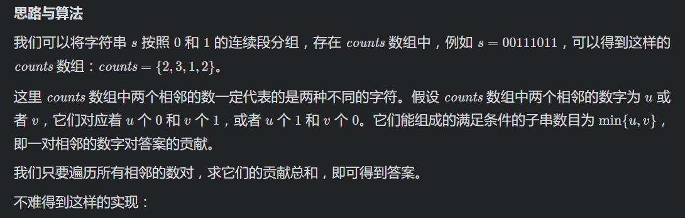

# [LeetCode 696. Count Binary Substrings](https://leetcode-cn.com/problems/count-binary-substrings/)

## Methods

### Method 1

* `Time Complexity`: O(n)
* `Space Complexity`: O(n)
* `Intuition`:
* `Key Points`:
* `Algorithm`:

brute force: iterate from left to right, and for every nums[i], we expand sliding window size and check if the substring qualify.
->
满足情况的substring要么是一半`0`一半`1`, 要么是一半`1`一半`0`;
对于`000111`, 有`3`个答案: `01``0011``000111`, 所以当一个input 是 `000111001101`时候, 我们找到当前最长的substring`000111`, 得出来答案3, 然后直接跳到下一个最长的substring`0011` -> 再`01`, 这样能满足条件吗? 好像不太行, 因为我们找到`000111`后, 下次答案应该是`11100`, 因为我们要考虑重叠.
->


### Code1

* `Code Design`:

```python
class Solution:
    def countBinarySubstrings(self, s: str) -> int:
        if len(s) < 2:
            return 0

        arr = []
        length = 0
        # 双指针
        i = 0
        j = 0
        while j < len(s):
            if s[j] == s[i]:
                length += 1
                j += 1
            else:
                arr.append(length)
                length = 0
                i = j
        arr.append(j - i) # 别忘了最后一组
        ans = 0
        for i in range(1, len(arr)):
            ans += min(arr[i], arr[i-1])
        return ans
```

* `Time Complexity`: O(n)
* `Space Complexity`: O(1)

```java
class Solution {
    public int countBinarySubstrings(String s) {
        int ptr = 0, n = s.length(), last = 0, ans = 0;
        while (ptr < n) {
            char c = s.charAt(ptr);
            int count = 0;
            while (ptr < n && s.charAt(ptr) == c) {
                ++ptr;
                ++count;
            }
            ans += Math.min(count, last);
            last = count;
        }
        return ans;
    }
}
```

## reference

[LeetCode-Solution](https://leetcode-cn.com/problems/count-binary-substrings/solution/ji-shu-er-jin-zhi-zi-chuan-by-leetcode-solution/)
