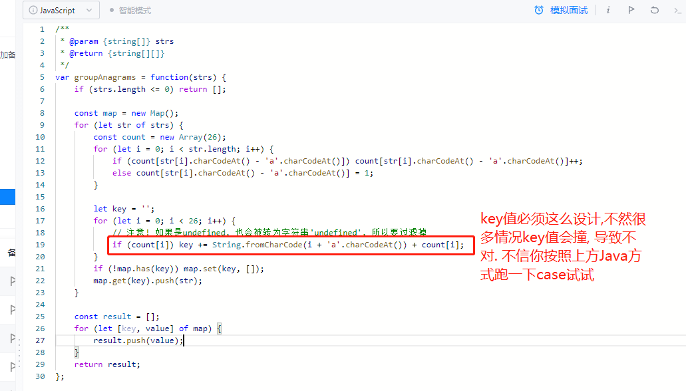

# 49. Group Anagrams

[LeetCode 49](https://leetcode.com/problems/group-anagrams/)

## Methods

### Method 1 --not the best method

```
time:
O(nklogk) k is the length of `string`:
```

Two strings are anagrams if and only if their sorted strings are equal.

Maintain a `map`  : {String -> List} where each `key` is a sorted string, and each value is the list of strings from the initial input that when sorted, are equal to `key`.


### Key Points

### Code

```java
class solution() {
    public List<List<String>> groupAnagrams(String[] strs) {
        if (strs == null || strs.length == 0) return new ArrayList<>();
        Map<String, List<String>> map = new HashMap<>();
        for (String s : strs) {
            char[] ca = s.toCharArray();
            Arrays.sort(ca);
            String keyStr = String.valueOf(ca);
            if (!map.containsKey(keyStr)) map.put(keyStr, new ArrayList<>());
            map.get(keyStr).add(s);
        }
        return new ArrayList<>(map.values());
    }
}

```

```javascript

/**
 * @param {string[]} strs
 * @return {string[][]}
 */
var groupAnagrams = function(strs) {
    if (strs.length <= 0) return [];

    const map = new Map();
    for (let str of strs) {
        let sortedStr = str.split('').sort().join('');
        if (!map.has(sortedStr)) map.set(sortedStr, []);
        map.get(sortedStr).push(str);
    }

    const result = [];
    for (let [key, value] of map) {
        result.push(value);
    }
    return result;
};
```

### Method 2 -- best method

```
time: O(nk)

```

Two strings are anagrams if and only if their character counts (respective number of occurrences of each character) are the same.

We can transform each string  into a character count, `count`, consisting of 26 non-negative integers representing the number of a's, b's, c's, etc. We use these `counts` as the key for our hash map.

### code

错误答案:

```java
public class Solution {

    public List<List<String>> groupAnagrams(String[] strs) {

        Map<String, List<String>> map = new HashMap<>();

        for (String s : strs) {
            //count
            int[] counts = new int[26];
            for (int i = 0; i < s.length(); i++) {
                counts[s.charAt(i) - 'a']++;
            }

            String keyStr = "";
            // 错误!!!
            for (int i = 0; i < counts.length; i++) keyStr += counts[i];

            if (!map.containsKey(keyStr)) map.put(keyStr, new ArrayList<>());
            map.get(keyStr).add(s);
        }

        return new ArrayList<>(map.values());
    }
}
```

正确答案:


```JavaScript
/**
 * @param {string[]} strs
 * @return {string[][]}
 */
var groupAnagrams = function(strs) {
    if (strs.length <= 0) return [];

    const map = new Map();
    for (let str of strs) {
        const count = new Array(26);
        for (let i = 0; i < str.length; i++) {
            if (count[str[i].charCodeAt() - 'a'.charCodeAt()]) count[str[i].charCodeAt() - 'a'.charCodeAt()]++;
            else count[str[i].charCodeAt() - 'a'.charCodeAt()] = 1;
        }

        let key = '';
        for (let i = 0; i < 26; i++) {
            // 注意! 如果是undefined, 也会被转为字符串'undefined', 所以要过滤掉
            if (count[i]) key += String.fromCharCode(i + 'a'.charCodeAt()) + count[i];
        }
        if (!map.has(key)) map.set(key, []);
        map.get(key).push(str);
    }

    const result = [];
    for (let [key, value] of map) {
        result.push(value);
    }
    return result;
};
```

## Reference

[LeetCode Discussion](https://leetcode.com/problems/group-anagrams/discuss/19176/Share-my-short-JAVA-solution)