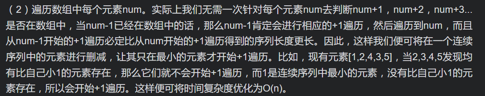

# [LeetCode 128. Longest Consecutive Sequence](https://leetcode-cn.com/problems/longest-consecutive-sequence/)

## Methods

### Method 1

* `Time Complexity`:
* `Space Complexity`:
* `Intuition`: brute force: 遍历每一个元素num, 对每个元素num, 去判断num + 1, num + 2...等是否在数组中 -> 优化
* `Key Points`:
* `Algorithm`:



### Code1

* `Code Design`:

```java
class Solution {
    public int longestConsecutive(int[] nums) {
        // 建立一个存储所有数的哈希表，同时起到去重功能
        Set<Integer> set = new HashSet<>();
        for (int num : nums) {
            set.add(num);
        }

        int ans = 0;
        // 遍历所有数字，已经经过去重
        for (int num : set) {
            int cur = num;
            // 只有当num-1不存在时，才开始向后遍历num+1，num+2，num+3......
            if (!set.contains(cur - 1)) {
                while (set.contains(cur + 1)) {
                    cur++;
                }
            }
            // [num, cur]之间是连续的，数字有cur - num + 1个
            ans = Math.max(ans, cur - num + 1);
        }
        return ans;
    }
}
```

## Reference1

作者：yimeixiaobai
链接：https://leetcode-cn.com/problems/longest-consecutive-sequence/solution/xiao-bai-lang-ha-xi-ji-he-ha-xi-biao-don-j5a2/
来源：力扣（LeetCode）
著作权归作者所有。商业转载请联系作者获得授权，非商业转载请注明出处。

----------------------

### Method 2

* `Time Complexity`:
* `Space Complexity`:
* `Intuition`:
* `Key Points`:
* `Algorithm`:

这种方法其实也是思路1的变种，用于减少遍历次数。做法是建立一个哈希表，记录每个元素num能够连续到达的右边界，这样在内层循环遍历到一个新元素时，无需经过多次+1遍历+判断才能到达右边界，直接取值即可。

每次while循环中把遍历到的right键值对删除，只通过最后一步put保留这次循环中最小元素到最大元素的键值对。这样后续元素才可以因为map中没有相应的key提前退出循环，达到减少遍历次数的效果。

### Code2

* `Code Design`:

```java
class Solution {
    public int longestConsecutive(int[] nums) {
        // key表示num，value表示num最远到达的连续右边界
        Map<Integer, Integer> map = new HashMap<>();
        // 初始化每个num的右边界为自己
        for (int num : nums) {
            map.put(num, num);
        }

        int ans = 0;
        for (int num : nums) {
            int right = map.get(num);
            // 遍历得到最远的右边界
            while (map.containsKey(right + 1)) {
                right = map.get(right + 1);
            }
            // 更新右边界
            map.put(num, right);
            // 更新答案
            ans = Math.max(ans, right - num + 1);
        }
        return ans;
    }
}
```

## Reference2

作者：yimeixiaobai
链接：https://leetcode-cn.com/problems/longest-consecutive-sequence/solution/xiao-bai-lang-ha-xi-ji-he-ha-xi-biao-don-j5a2/