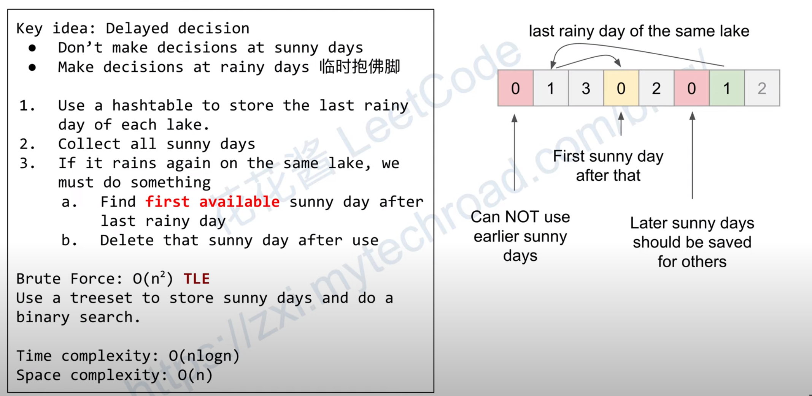

# 1488. Avoid Flood in The City

[LeetCode 1488](https://leetcode.com/problems/avoid-flood-in-the-city/)


## Methods

### Method 1
* `Time Complexity`: O(nlogn)
* `Intuition`: 
    
* `Algorithm`: 
At first, we will notice that if current day `i` is sunny day `rains[i] == 0` we need to know 2 tings: 1. which lakes are full before the day `i`
2. the second time a lake are full water again after close the day `i`.  
for example: `[3,4,0,3 ...]` when the sunny day, we need to fill `ans[2] = 3` because lake`3` will rain after the sunny day.

but this thought couldn't deal with `[1,2,0,1,2]` , so we need to consider delayed decision. 


### Key Points
Delayed Decision. 

### Code
```java

class Solution {
    public int[] avoidFlood(int[] rains) {
        int[] ans = new int[rains.length]; 
        TreeSet<Integer> set = new TreeSet<>(); // store sunny day      
        HashMap<Integer, Integer> map = new HashMap<>(); // key = fulled lake(rains[i]), value = the date last time this lake is full  
        
        for (int i = 0; i < rains.length; i++) {
            // if current is sunny day 
            if (rains[i] == 0) {
                set.add(i); // store it to set 
                ans[i] = 1; // set extra sunny day to 1. example:[44, 0,0,0,44] we need return [-1, 44, 1,1,-1].
            }else {
                ans[i] = -1;
                if (map.containsKey(rains[i])) {
                    int last = map.get(rains[i]); // the date last time this lake is full
                    // find the closest sunny day bigger than last 
                    int sunny = set.higher(last) == null ? -1 : set.higher(last); 
                    if (sunny == -1) return new int[0];
                    ans[sunny] = rains[i]; 
                    set.remove(sunny); 
                }
                map.put(rains[i], i); 
            }
        }
        return ans;
        
    }
}

```


## Reference
[video](https://www.youtube.com/watch?v=8sxeQyumrYc)