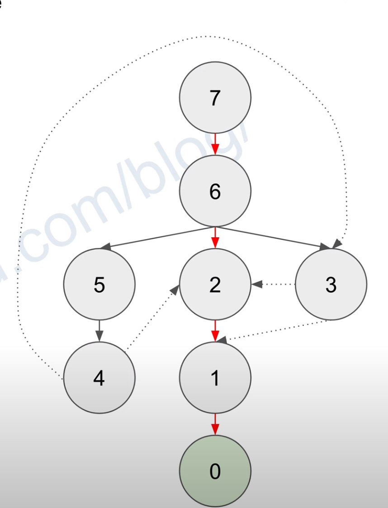

# 1553. Minimum Number of Days to Eat N Oranges

[LeetCode 1553](https://leetcode.com/problems/minimum-number-of-days-to-eat-n-oranges/)


## Methods

### Method 1
* `Time Complexity`:  O(n)
* `Intuition`:BFS
* `Key Points`: 
* `Algorithm`: 

Think of this problem as a tree in which we start from the root `n`. At any node, it connects to up to 3 children `n-1`, `n/2 if n%2 == 0`, `n/3 if n%3 == 0`. Then we can level order traverse the tree and find the first occurrence of `0` and return its level.
### Code
* `Code Design`: 
```java


```


## Reference