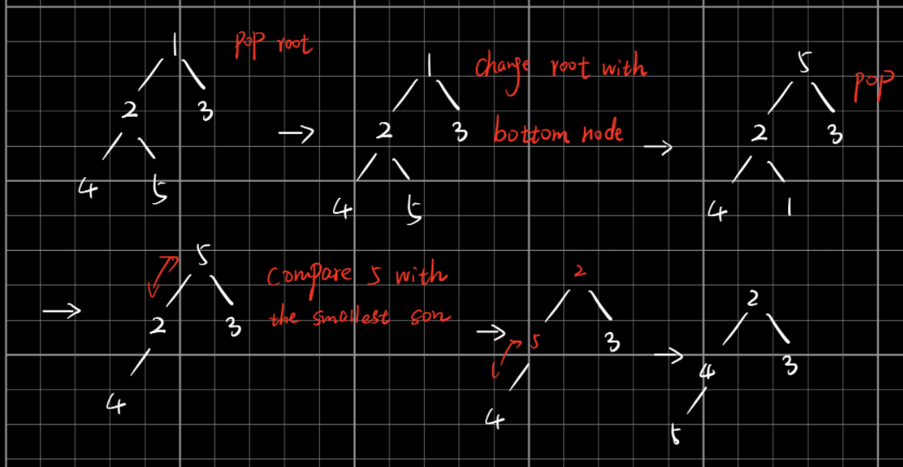
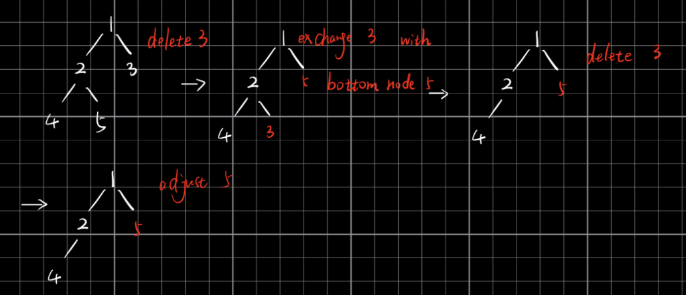
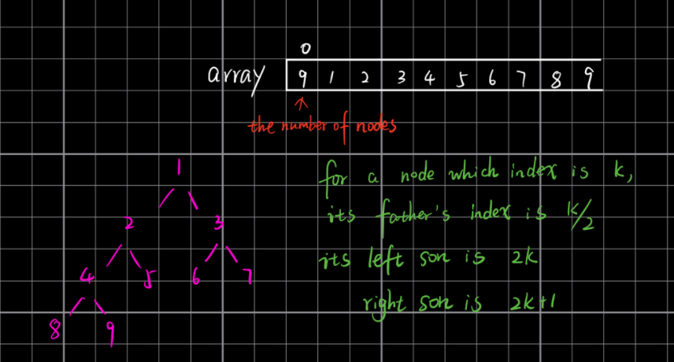

# heap

## heap定义

* Heap is the name of data structure. In java, to implement heap, they use a function named PriorityQueue
* In python, to implement heap, they use a function named heapq
* heap has two classes：minheap and maxheap; minheap: the son is must greater than parent but the two son cannot compare; maxheap: the son is lowest than parent

## heap properties

* value: all left son and right son couldn't compare with value, it is not certain which one is bigger; min heap: parent is smaller than son; max heap: parent is bigger than son
* 结构特性：从上到下 从左到右 依次增加节点. 用英文说, it is a complete tree

## basic operation

### push()

先插入到最底层且最左边的空位, 然后不停和parent比较大小, 上下调换


### pop() - O(logN)



### delete()



when pop(), adjust must be from current position to down
but delete(), adjust node maybe from current to up or down

## [heapify](https://en.wikipedia.org/wiki/Heapsort)

[youtube video](https://www.youtube.com/watch?v=5iBUTMWGtIQ)

time complexity: O(n)



heapify是从array下标二分之一处开始处理。 因为这一行刚好对应倒数第二行。
先先换对调左子树，再比较对调右子树

以min-heap举例:
当前节点`parent`跟两个儿子比较, 如果比两个儿子都小, 那符合条件不用管
如果当前`parent`节点比两个儿子大, 那么一直把该节点向下移动进行`siftdown`, 直到合适的位置为止

```python
class Solution:
   """
   @param: A: Given an integer array
   @return: nothing
   """
   def heapify(self, nums):
      n = len(nums)
      for i in range(len(nums) // 2, -1, -1):
         self.siftdown(n, nums, i)

   def siftdown(self, n, nums, index):
      if index >= n:
         return
      left = index * 2 + 1
      right = index * 2 + 2
      minIndex = index
      if left < n and nums[left] < nums[minIndex]:
         minIndex = left
      if right < n and nums[right] < nums[minIndex]:
         minIndex = right

      if minIndex != index:
         nums[minIndex], nums[index] = nums[index], nums[minIndex]
         self.siftdown(n, nums, minIndex)
```
