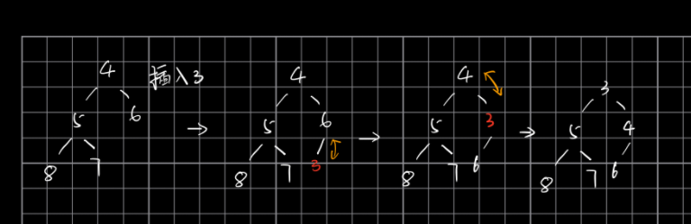

# heap

## heap定义

* Heap is the name of data structure. In java, to implement heap, they use a function named PriorityQueue
* In python, to implement heap, they use a function named heapq
* heap has two classes：minheap and maxheap; minheap: the son is must greater than parent but the two son cannot compare; maxheap: the son is lowest than parent

## heap性质

* 数值上: 左右儿子之间没大小关系; min heap: 父亲小于儿子; max heap: 父亲大于儿子
* 结构特性：从上到下 从左到右 依次增加节点. 用英文说, it is a complete tree

## 基本操作

### push

先插入到最底层且最左边的空位, 然后不停和parent比较大小, 上下调换

### pop()

