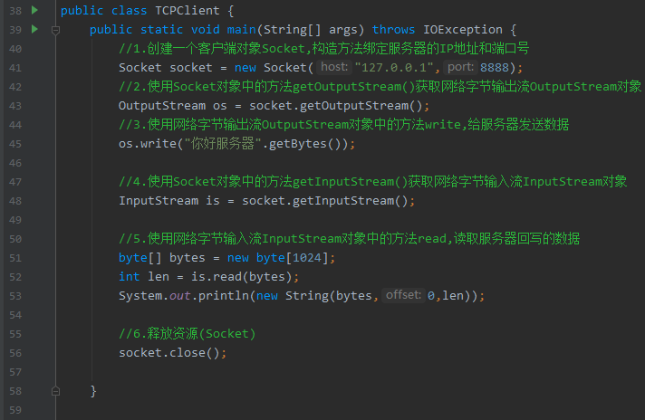
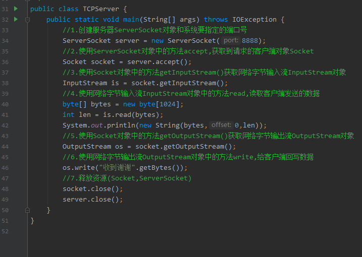

##软件结构
    1. C/S结构 ：全称为Client/Server结构
    2. B/S结构 ：全称为Browser/Server结构
    
    

##TCP通信
    1. 客户端和服务器通过 IO对象进行通信，通讯的数据不仅仅是字符，所以IO对象叫做字节流对象

##Java Socket类--套接字
    1. 客户端

    
    2. 服务器             
        
        