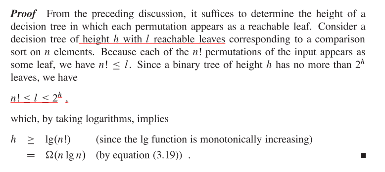

#Sort

    1. application fields 
        1. Find a median number 
        2. Computer Graphic : render
        3. Files Compression
        
        
##HeapSort

    1. heap： 
       for every nodes:
            A[parent] >= A[i] (maxheap)
            A[parent] <= A[i]  (minheap)
           
    2. build heap:
        min heapify(3 nodes) + Maintaining the heap property(using min/Max heapify from i to end)  +  loop iterators from i / 2 to 1
        
    3. time complexity:
        heapify: logn
        from i/2 to 1: n/2
        so O(nlogn)? But it is rough. The true is O(n). 
        
    4. heapSort

##Prove Sorting time Complexity
    1. decision Tree:
        ` decision tree is binary
        ` leaves are answers 
        ` the number of leaves >= (at least) the number of possible answers(n!)
        
    2. binary search:
        1. from decision tree, we can get that best case is logn

    3. Comparison Sort
        1. lower bound

##Counting Sort
https://www.youtube.com/watch?v=TTnvXY82dtM
    
    1.     

        