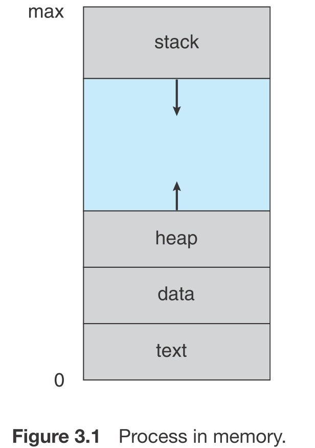
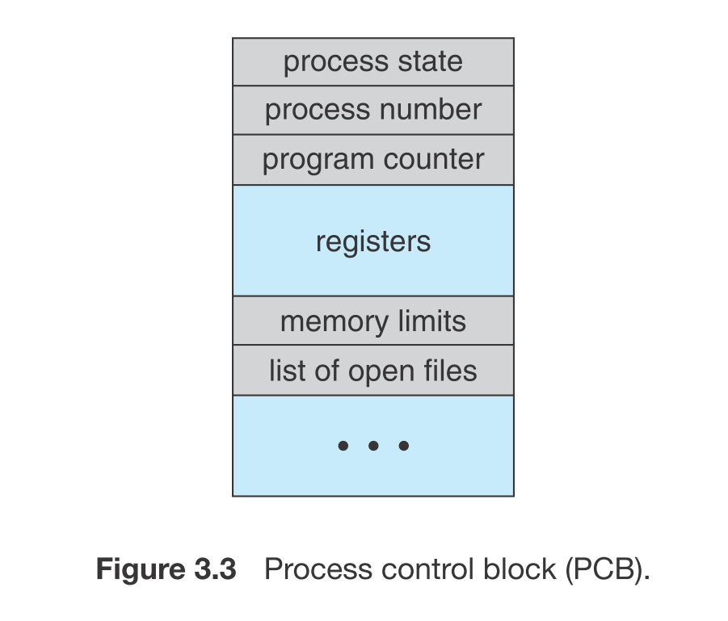

# Processes 

## Process Concept
* A process is an instance of a program in execution
* Process memory is divided into four sections as shown in Figure 3.1 below:
    * The text section comprises the compiled program code, read in from non-volatile storage when the program is launched.
    * The data section stores global and static variables, allocated and initialized prior to executing main.
    * The heap is used for dynamic memory allocation, and is managed via calls to new, delete, malloc, free, etc.
    * The stack is used for local variables. Space on the stack is reserved for local variables when they are declared ( at function entrance or elsewhere, depending on the language ), and the space is freed up when the variables go out of scope. Note that the stack is also used for function return values, and the exact mechanisms of stack management may be language specific.
    * Note that the stack and the heap start at opposite ends of the process's free space and grow towards each other. If they should ever meet, then either a stack overflow error will occur, or else a call to new or malloc will fail due to insufficient memory available.
* When processes are swapped out of memory and later restored, additional information must also be stored and restored. Key among them are the program counter and the value of all program registers.

### Process State 
* Processes may be in one of 5 states, as shown
`New` - The process is in the stage of being created.
`Ready` - The process has all the resources available that it needs to run, but the CPU is not currently working on this process's instructions.
`Running` - The CPU is working on this process's instructions.
`Waiting` - The process cannot run at the moment, because it is waiting for some resource to become available or for some event to occur. For example the process may be waiting for keyboard input, disk access request, inter-process messages, a timer to go off, or a child process to finish.
`Terminated` - The process has completed.

### Process Control Block 
For each process there is a Process Control Block, PCB, which stores the following ( types of ) process-specific information, as illustrated in Figure 3.1

`Process State` - Running, waiting, etc., as discussed above.
`Process ID`, and parent process ID.
`CPU registers and Program Counter` - These need to be saved and restored when swapping processes in and ou of the CPU.
`CPU-Scheduling information` - Such as priority information and pointers to scheduling queues.
`Memory-Management information` - E.g. page tables or segment tables.
`Accounting information` - user and kernel CPU time consumed, account numbers, limits, etc.
`I/O Status information` - Devices allocated, open file tables, etc.

## Process Scheduling
* The two main objectives of the process scheduling system are to keep the CPU busy at all times and to deliver "acceptable" response times for all programs, particularly for interactive ones.
* The OS maintains all PCBs in Process Scheduling Queues. The OS maintains a separate queue for each of the process states and PCBs of all processes in the same execution state are placed in the same queue.
* The process scheduler must meet these objectives by implementing suitable policies for swapping processes in and out of the CPU.

`Job queue` − This queue keeps all the processes in the system.
`Ready queue` − This queue keeps a set of all processes residing in main memory, ready and waiting to execute. A new process is always put in this queue.
`Device queues` − The processes which are blocked due to unavailability of an I/O device constitute this queue.

### Process Scheduler
 because OS need to decide which process to be executed, it is operated by Schedulers. 
 where are 3 types: 
    * Long-Term Scheduler
    `A long-term scheduler is typical of a batch system or a very heavily loaded system. It runs infrequently, ( such as when one process ends selecting one more to be loaded in from disk in its place ), and can afford to take the time to implement intelligent and advanced scheduling algorithms.`
    * Short-Term Scheduler
    `The short-term scheduler, or CPU Scheduler, runs very frequently, on the order of 100 milliseconds, and must very quickly swap one process out of the CPU and swap in another one.` 
    * Medium-Term Scheduler 
    `Some systems also employ a medium-term scheduler. When system loads get high, this scheduler will swap one or more processes out of the ready queue system for a few seconds, in order to allow smaller faster jobs to finish up quickly and clear the system. See the differences in Figures 3.7 and 3.8 below.`
### Context Switch
* Context is in PCB of the process. 
*  Interrupts cause the operating system to change a CPU from its current task and to run a kernel routine. Such operations happen frequently on general-purpose systems. When an interrupt occurs, the system
  needs to save the current **context** of the process running on the CPU so that
  it can restore that **context** when its processing is done, essentially suspending the process and then resuming it.
* Switching the CPU to another process requires performing a state save of the current process and a state restore of a different process. This task is known as a context switch.

## Operations on Processes

### Process Creation 
* Processes may create other processes through appropriate system calls, such as fork or spawn. The process which does the creating is termed the parent of the other process, which is termed its child.
* Each process is given an integer identifier, termed its process identifier, or PID. The parent PID ( PPID ) is also stored for each process
When a process creates a new process, two possibilities exist for execution:
* The parent continues to execute concurrently with its children.
* The parent waits until some or all of its children have terminated.
There are also two possibilities for the address space of the new process:
* The child process is a duplicate of the parent process (it has the same program and data as the parent).
* The child process has a new program loaded into it

### Interprocess Communication
* Independent Processes operating concurrently on a systems are those that can neither affect other processes or be affected by other processes.
* Cooperating Processes are those that can affect or be affected by other processes.
why cooperating processes are allowed:
* Information Sharing - There may be several processes which need access to the same file for example. ( e.g. pipelines. )
* Computation speedup - Often a solution to a problem can be solved faster if the problem can be broken down into sub-tasks to be solved simultaneously ( particularly when multiple processors are involved. )
* Modularity - The most efficient architecture may be to break a system down into cooperating modules. ( E.g. databases with a client-server architecture. )
* Convenience - Even a single user may be multi-tasking, such as editing, compiling, printing, and running the same code in different windows.

* Cooperating processes require some type of **inter-process communication**, which is most commonly one of two types: Shared Memory systems or Message Passing systems.

* Shared Memory is faster once it is set up, because no system calls are required and access occurs at normal memory speeds. However it is more complicated to set up, and doesn't work as well across multiple computers. Shared memory is generally preferable when large amounts of information must be shared quickly on the same computer.
* Message Passing requires system calls for every message transfer, and is therefore slower, but it is simpler to set up and works well across multiple computers. Message passing is generally preferable when the amount and/or frequency of data transfers is small, or when multiple computers are involved.

    #### message passing 
    * Message passing systems must support at a minimum system calls for "send message" and "receive message".
    * A communication link must be established between the cooperating processes before messages can be sent.
    * With **direct communication** the sender must know the name of the receiver to which it wishes to send a message.
    * There is a one-to-one link between every sender-receiver pair.
    * **Indirect communication** uses shared mailboxes, or **ports**.
    * Multiple processes can share the same mailbox or boxes.
    
## Communication in Client-Server Systems
we discuss process communication before, now let's discuss client-server communication through networks. 
There are two other strategies for communication in client–server systems: 
 * sockets 
 * remote procedure calls.
 
### Socket
* A socket is defined as an endpoint for communication.  A pair of processes communicating over a network employ a pair of sockets—one for each process
* Two processes communicating over a network often use a pair of connected sockets as a communication channel. Software that is designed for client-server operation may also use sockets for communication between two processes running on the same computer - For example the UI for a database program may communicate with the back-end database manager using sockets. ( If the program were developed this way from the beginning, it makes it very easy to port it from a single-computer system to a networked application. )
* A socket is identified by an IP address concatenated with a port number, e.g. 200.100.50.5:80.

Communication channels via sockets may be of one of two major forms:
* TCP
* UDP
### Remote Procedure calls
In distributed computing, a remote procedure call (RPC) is when a computer program causes a procedure (subroutine) to execute in a different address space (commonly on another computer on a shared network), which is coded as if it were a normal (local) procedure call, without the programmer explicitly coding the details for the remote interaction. That is, the programmer writes essentially the same code whether the subroutine is local to the executing program, or remote. 

 
