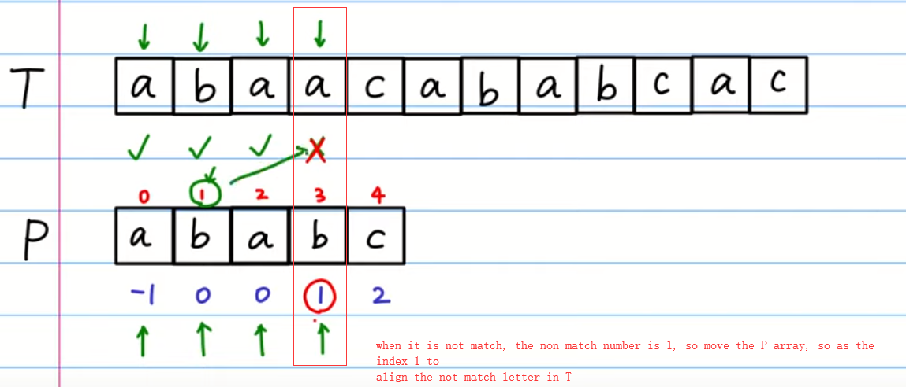
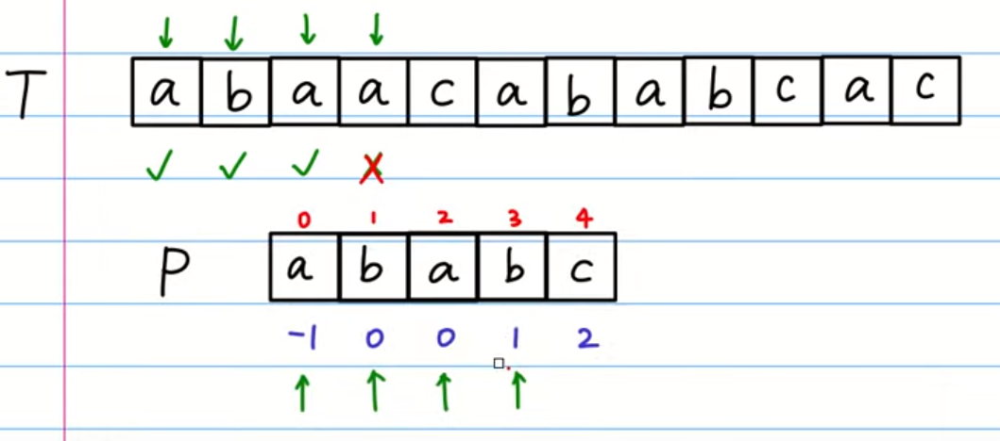

# KMP

[LeetCode ]()


## Methods

### Method 1



set a prefix table

### Key Points


### Code
```java
public class Solution {
    /**
     * @param source: 
     * @param target: 
     * @return: return the index
     */
    public int strStr(String source, String target) {
        if(target.length()==0 ){
            return 0;
        }
        int c = 0, d = 0;
        char[] sourceC = source.toCharArray();
        char[] targetC = target.toCharArray();
        int[] next = getNext(targetC); 
        while(c<sourceC.length && d<targetC.length){
            if( d == -1 || sourceC[c] == targetC[d] ){
                c++;
                d++;
            }else{
                d = next[d];
            }
        }
        if(d ==targetC.length){
            return c-d;
        }
        return -1;      
    }

    //get next array 
    protected int[] getNext(char[] p) {
        int[] next = new int[p.length];
        int a = -1, b = 0; 
        next[0]= -1;
        
        while(b <p.length-1){
            if( a == -1 || p[a] == p[b] ){
                a++;
                b++;
                next[b] = a;
            }else{
                a = next[a];
            }
        }
        return next;
    }
}

```


## Reference
method https://www.youtube.com/watch?v=dgPabAsTFa8&t=1010s