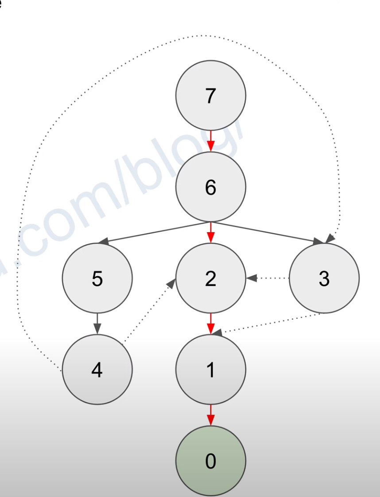

# 1553. Minimum Number of Days to Eat N Oranges

[LeetCode 1553](https://leetcode.com/problems/minimum-number-of-days-to-eat-n-oranges/)


## Methods

### Method 1
* `Time Complexity`:  O(n)
* `Intuition`:BFS
* `Key Points`: 
* `Algorithm`: 

Think of this problem as a tree in which we start from the root `n`. At any node, it connects to up to 3 children `n-1`, `n/2 if n%2 == 0`, `n/3 if n%3 == 0`. Then we can level order traverse the tree and find the first occurrence of `0` and return its level.
### Code
* `Code Design`: 
```java
class Solution {
    public int minDays(int n) {
        Deque<Integer> queue = new ArrayDeque<>();
        HashSet<Integer> set = new HashSet<>();
        int level = 0;

        queue.addLast(n);
        while (!queue.isEmpty()) {
            int size = queue.size();
            while (size > 0) {
                size--;
                int nodeValue = queue.removeFirst();
                if (nodeValue == 0) return level;
                if (!set.contains(nodeValue - 1)) {
                    set.add(nodeValue - 1);
                    queue.addLast(nodeValue - 1);
                }
                if (nodeValue % 2 == 0 && !set.contains(nodeValue / 2)) {
                    set.add(nodeValue / 2);
                    queue.addLast(nodeValue / 2);
                }
                if (nodeValue % 3 == 0 && !set.contains(nodeValue / 3)) {
                    set.add(nodeValue / 3);
                    queue.addLast(nodeValue / 3);
                }
            }
            level++;
        }
        return 1;
    }
}

```


## Reference